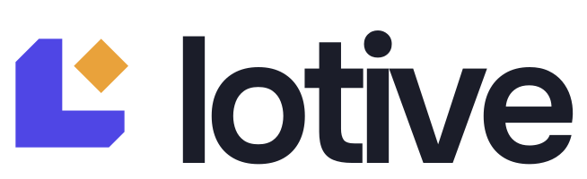
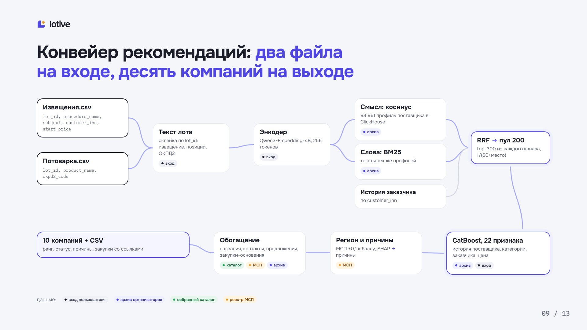
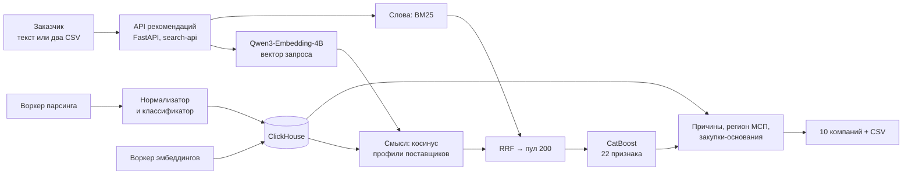
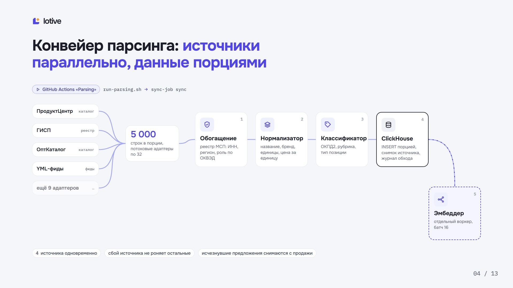
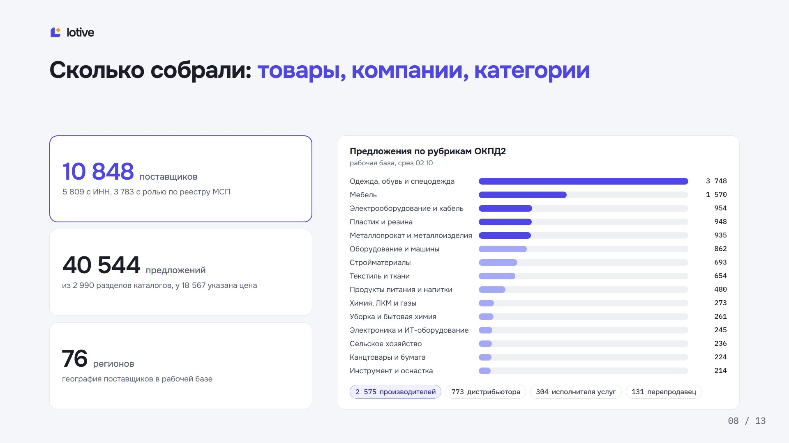

<p align="center">
  <a href="https://rlt.goatwhistle.ru/">
    <picture>
      <source media="(prefers-color-scheme: dark)" srcset="docs/brand/wordmark-dark.svg"/>
      
    </picture>
  </a>
</p>

<p align="center">
  <b>Подбор поставщиков для закупок Санкт-Петербурга.</b><br/>
  По данным закупки система возвращает десять компаний, и у каждой есть основание:<br/>
  закупка, дата и ссылка на источник. Решение остаётся за заказчиком.
</p>

<p align="center">
  <a href="https://rlt.goatwhistle.ru/"></a>
  <a href="docs/README.md"></a>
</p>

<p align="center">
  <a href="#идея"></a>
  <a href="#три-решения"></a>
  <a href="#как-это-работает"></a>
  <a href="#попробовать-за-две-минуты"></a>
  <a href="#что-измерено"></a>
  <a href="#запуск"></a>
  <a href="#ограничения"></a>
</p>

<p align="center">
  
  
  
  
  
</p>

<p align="center">
  
</p>

---

## Идея

Контрактный управляющий получает закупку, и ему нужно понять, кого позвать, а потом письменно
обосновать выбор. Поиск по названию здесь не помогает:

- в реестре МСП **6,77 млн** компаний, вручную их не перебрать;
- **16 004** из 44 199 поставщиков архива встречаются в нём всего один раз, статистику по ним не построить;
- в архиве АИС ГЗ видны победы, но нет цен предложений и оценок исполнения.

Поэтому Lotive не выдаёт один балл. Он строит короткий список и рядом с каждой компанией
показывает, на чём держится рекомендация: прошлые закупки в той же категории, их даты и ссылки,
регион из реестра МСП, предложения из открытых каталогов.

## Три решения

<table>
<tr>
<td valign="top" width="33%">

**Смысл и точные слова вместе**

Кандидатов ищут два канала: векторы Qwen3-Embedding-4B и BM25. Списки сливаются через RRF,
затем CatBoost ранжирует пул из 200 по 22 признакам истории закупок. Гибрид находит больше
участников, чем каждый канал отдельно.

</td>
<td valign="top" width="33%">

**Основание рядом с утверждением**

Вклад признаков превращается в понятные причины: релевантность, опыт, категория, заказчик,
давность, цена. К каждой компании прикладываются до пяти закупок-оснований с датой и ссылкой.

</td>
<td valign="top" width="33%">

**Пул шире архива**

Фоновый воркер обходит открытые каталоги, приводит карточки к одной форме, присваивает код
ОКПД2 с указанием канала и его уверенности и складывает всё в ClickHouse. Классификатор не
угадывает: без основания код не ставится.

</td>
</tr>
</table>

## Как это работает

Lotive — веб-сервис из двух контуров. API рекомендаций отвечает на запрос заказчика за секунды,
а фоновые воркеры независимо от него пополняют каталог.



Подробно по частям:

- [Фоновые воркеры: парсер и эмбеддер](docs/workers.md)
- [Как устроены нормализатор и классификатор](docs/normalization-and-classification.md)
- [Поиск, ранжирование и метрики](docs/ml/README.md)
- [HTTP API и коды ошибок](docs/backend.md#http-api), [примеры запросов и ответов](docs/api-contracts.md)

<p align="center">
  
</p>

## Попробовать за две минуты

| Шаг | Что сделать | Что увидите |
|---|---|---|
| 1 | Откройте [rlt.goatwhistle.ru](https://rlt.goatwhistle.ru/) | Поле поиска и историю запросов |
| 2 | Опишите, что нужно, например «перчатки хирургические латексные» | Десять компаний с ролью, регионом и статусом |
| 3 | Выберите компанию | Почему она в списке: причины, число закупок и побед, закупки-основания со ссылками |
| 4 | Загрузите извещения и потоварку двумя CSV | Список по каждой закупке, склеенный по `lot_id` |
| 5 | Нажмите «Скачать CSV» | Файл, который можно приложить к обоснованию выбора |

## Что измерено

Качество проверено на закрытом test: 1 000 закупок 2025 года, история только до 01.06.2025,
test открыт один раз после фиксации модели. Метка — реальные участники и победитель закупки.

| Показатель | Поиск | + CatBoost |
|---|---:|---:|
| Известный участник в топ-10 | 48,0 % | **60,4 %** |
| Победитель в топ-10 | 40,7 % | **52,3 %** |
| MRR победителя | 0,275 | **0,340** |

Прирост MRR +0,065, 95 % доверительный интервал +0,048…+0,082. Полнота поиска участников на
validation (Recall@100): 0,531 у BM25 и 0,610 у гибрида с Qwen3-Embedding-4B. Каждая цифра,
её команда и выборка — в [журнале экспериментов](docs/ml/experiments.md).

<p align="center">
  
</p>

## Запуск

```bash
cp .env.example .env
docker compose up -d --build
docker compose run --rm sync-job sync
```

Фронтенд откроется на `http://localhost:8080`, API — на `http://localhost:8000/api`.
Исходные данные лежат в `task/data/` в Git LFS: после клонирования выполните `git lfs pull`.
Переменные окружения, миграции, проверки и CI/CD описаны в [запуске и проверках](docs/running.md).

## Документация

| Раздел | Что внутри |
|---|---|
| [Оглавление](docs/README.md) | Все страницы документации |
| [Запуск и проверки](docs/running.md) | Требования, Docker Compose, переменные, миграции, тесты |
| [Backend](docs/backend.md) | Слои, джоба сбора, адаптеры источников, HTTP API |
| [ML и качество](docs/ml/README.md) | Подготовка данных, поиск, ранжирование, метрики |
| [Презентация защиты](docs/defense/presentation.html) | Слайды, [PDF](docs/defense/presentation.pdf) и [короткая версия](docs/defense/presentation-mini.html) |
| [Задание организаторов](task/docs/presentation.pdf) | Исходное ТЗ и [его текст](task/docs/presentation.md) |

## Ограничения

- **Метка качества неполная.** Участник закупки в истории не единственная подходящая компания,
  поэтому реальная польза списка выше измеренной.
- **История и каталоги пока идут двумя каналами.** Кандидаты из каталогов получают статус
  проверки; единое ранжирование — следующий шаг.
- **Замеры скорости сделаны на синтетике.** Миллион реальных предложений не проверялся.

<p align="center"><sub>Команда GoatWhistle, хакатон RLT и Комитета по государственному заказу Санкт-Петербурга, 2026.</sub></p>
