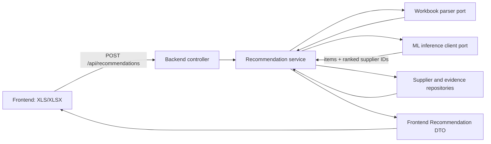

# Контракт backend–ML: рекомендация поставщиков

**Версия:** v1, целевой контракт для реализации.  
**Статус:** спецификация интерфейса; HTTP endpoint, parsing upload и production inference пока не реализованы.  
**Источники:** `task/ML_SPEC.md`, текущие модели backend, контракт фронтенда `frontend/src/entities/recommendation/model.ts` и измерения `ml/EXPERIMENTS.md`.

Документ фиксирует границу между backend, ML-компонентом, источниками сведений о поставщиках и фронтендом. Это контракт данных и поведения, а не утверждение, что весь описанный pipeline уже работает в production.

## 1. Цель и границы

По загруженному описанию закупки backend должен вернуть предполагаемые позиции закупки и ранжированный список компаний, подходящих для проверки/поставки. Ответ включает основания и источники, которые позволяют пользователю проверить результат.

В системе отдельно решаются четыре задачи:

1. Разобрать пользовательский файл и получить канонические поля лота и явно указанные позиции.
2. При наличии модуля извлечения — предложить дополнительные позиции и коды ОКПД2, сохраняя происхождение и неопределённость каждой позиции.
3. Найти компании-кандидаты гибридным поиском по тексту закупки/позициям и профилям деятельности.
4. Обогатить найденные ИНН сведениями о компании, товарах/услугах и проверяемыми основаниями; при включённом и отдельно валидированном ranker-е пересортировать кандидатов.

Историческое участие и победа — наблюдаемые факты, но не доказательство качества компании, доступности товара сейчас или гарантии будущей победы. Similarity score и CatBoost score не являются вероятностями.

Текущие компоненты ML — офлайн-подготовка данных, retrieval CLI и обучение CatBoost. Сервинг-компонента и полного end-to-end прогона ещё нет. До её появления backend обязан показывать результат как предположительную рекомендацию с источниками и причиной проверки, а не как установленную квалификацию поставщика.

## 2. Архитектура и ответственность



| Компонент | Ответственность | Не должен делать |
|---|---|---|
| Controller | Принимать multipart upload, валидировать transport-level ограничения, вызвать service и отдать HTTP DTO | Разбирать Excel вручную, искать поставщиков или принимать ML-решения |
| Service | Оркестрировать parse → infer → enrich → policy/status → response; применять таймауты и лимиты | Импортировать ClickHouse, HTTP SDK или конкретную ML-библиотеку |
| Adapter/client | Сериализовать запрос в ML endpoint, преобразовать ответ и transport errors | Содержать бизнес-правила рекомендации |
| ML runtime | Восстановить позиции, искать профили, вернуть кандидатов/ранги и версию pipeline | Ходить во внешние LLM/neural APIs или выдумывать сведения об организациях |
| Repository adapters | Читать факты участия, профили, offers, catalogue matches и verified evidence | Возвращать SQL/ClickHouse DTO в service/domain |

ML runtime может быть отдельным локальным процессом/контейнером для изоляции PyTorch/CUDA от backend runtime. Backend должен зависеть от порта, а не от конкретного размещения: транспорт внутри адаптера можно заменить, не меняя бизнес-сервис. In-process Python import допустим только как альтернативная инфраструктурная реализация того же порта.

Код backend размещается по существующим правилам:

- `backend/src/controller/recommendation/` — FastAPI route и HTTP DTO.
- `backend/src/service/recommendation/` — use case и его `protocols.py`.
- `backend/src/adapter/client/ml_service/` — клиент и wire DTO ML-сервиса.
- `backend/src/adapter/repository/` — порты/адаптеры хранилищ; SQL остаётся в ClickHouse adapter.
- `backend/src/models/` — только устойчивые бизнес-типы. HTTP payload, multipart DTO, таблицы и JSON ML API здесь не объявлять.

Все backend interfaces объявлять рядом с потребляющим слоем в `protocols.py`; весь backend код асинхронный. Если inference библиотека синхронна, adapter/client выносит блокирующий вызов в управляемый пул/процесс.

## 3. HTTP-контракт для фронтенда

### Запрос

`POST /api/recommendations` — соответствует `RECOMMENDATIONS_PATH` во фронтенде. Запрос `multipart/form-data`, обязательное поле `file`; фронтенд сейчас принимает `.xlsx` и `.xls`. Фронтенд ожидает один JSON-ответ и валидирует его как `Recommendation`.

Backend проверяет расширение **и** фактический формат файла, пустой/повреждённый workbook, наличие хотя бы одного читаемого описания закупки, допустимость количества строк и серверный лимит размера. Численные лимиты размера и строк задаются конфигурацией backend/deploy, возвращаются как стабильные ошибки и не зашиваются в ML-модель. Имя из upload возвращается только как basename; путь и служебные метаданные клиента игнорируются.

Табличный parser преобразует файл в один канонический запрос закупки. Точный набор пользовательских заголовков/шаблон workbook должен быть определён отдельно; ML API не зависит от названий колонок Excel. На текущем экране один upload ведёт к одной странице `Recommendation` и одному `lotLabel`, поэтому multi-lot workbook в v1 либо разбирается как один явно обозначенный лот, либо отвергается ошибкой `multiple_lots_not_supported`; нельзя молча сливать разные закупки.

### Ответ 200

JSON shape остаётся совместимым с `frontend/src/entities/recommendation/model.ts`. Все обязательные ключи присутствуют, даже если значения строк пустые или списки пусты. Идентификаторы, ИНН и ОКПД2 сериализуются строками; ИНН нельзя преобразовывать в integer. `checkedAt` — RFC 3339 UTC.

```json
{
  "fileName": "закупка.xlsx",
  "requestTitle": "Поставка бумаги",
  "lotLabel": "Лот 1",
  "products": [
    {
      "id": "item-1",
      "name": "Бумага офисная",
      "okpd2": "17.12.14.129",
      "origin": "notice",
      "originNote": "Указано во входном файле"
    }
  ],
  "companies": [
    {
      "id": "supplier-uuid",
      "name": "ООО Пример",
      "inn": "0123456789",
      "role": "Поставщик",
      "status": "check",
      "checkReason": "Релевантность найдена по истории; актуальное предложение не подтверждено",
      "summary": "Участвовал в похожих закупках бумаги.",
      "matches": [
        { "productId": "item-1", "basis": "inferred" }
      ],
      "similarPurchases": 3,
      "wins": 1,
      "purchases": [
        {
          "title": "Поставка бумаги для офиса",
          "year": 2025,
          "outcome": "participant",
          "source": {
            "kind": "purchase",
            "title": "Источник записи закупки",
            "url": "https://example.org/purchase/123",
            "checkedAt": "2026-10-01T12:00:00Z"
          }
        }
      ],
      "clarify": ["Подтвердить актуальную цену и возможность поставки"]
    }
  ]
}
```

Значения перечислений строго соответствуют фронтенд-модели:

| Поле | Допустимые значения | Смысл |
|---|---|---|
| `products[].origin` | `notice`, `inferred`, `user` | Прямо извлечено из файла; гипотеза модели; подтверждено/отредактировано пользователем |
| `companies[].status` | `recommended`, `check` | Проходит текущую policy по проверяемым основаниям; либо нужна проверка/данных недостаточно |
| `matches[].basis` | `stock`, `catalog`, `inferred` | Есть текущее предложение; сопоставление с каталогом; только семантическая/историческая гипотеза |
| `source.kind` | `catalog`, `price`, `purchase`, `registry` | Тип первичного свидетельства. Ссылки без реально полученного источника не создавать |
| `purchases[].outcome` | `winner`, `participant` | Только факт исторического лота; не оценка качества компании |

Правила полей:

- `products[].id` — стабильный ID позиции в пределах ответа; все `matches[].productId` обязаны ссылаться на существующую позицию.
- `okpd2` всегда строка. Если код неизвестен или не подтверждён — `""`; не угадывать код и не выдавать родительскую категорию как точную.
- Прямо указанные позиции имеют `origin: "notice"`; предположенные — `inferred` с `originNote`, что это гипотеза; пользовательские исправления — `user`.
- `companies[].id` — стабильный внутренний ID supplier record. `inn` — строка; если ИНН неизвестен, ответ не может выдумать его. Текущий frontend требует строку, поэтому без ИНН отдавать пустую строку и обязательно `status: "check"` с `checkReason`.
- `role` описывает роль организации по evidence. Исторический участник или победитель не доказывает изготовление/дистрибуцию.
- `similarPurchases` — число подтверждённых похожих исторических участий, `wins` — число однозначно отмеченных побед в этих/доступных исторических данных. Не подменять отсутствующие данные нулями без явного определения поля: на текущем фронтенде поля обязательны, поэтому это значения счётчиков только в выбранном и указанном доступном временном окне.
- `purchases` содержит только фактические записи с годом и исходом. `source` добавлять лишь при наличии проверяемого URL. Отсутствие URL не мешает показать aggregate count, но это не источник для кликабельного доказательства.
- `matches` связывает компанию только с позициями, для которых есть отдельное основание. Не создавать матчи ко всем позициям по одному среднему similarity.
- `summary` кратко описывает факты и неопределённость, без генерации неподтверждённых маркетинговых утверждений. `clarify` содержит конкретные вопросы для пользователя.
- `recommended` допустим только при выполнении отдельно конфигурируемой policy: подходящая предметная связь плюс отсутствие блокирующего identity/ownership conflict и достаточные текущие основания. Одного historical winner или encoder score недостаточно. При неполном профиле, неподтверждённой роли, отсутствии ИНН или отсутствии актуального предложения — `check`.
- Если не найдено ни одной компании, frontend сейчас не имеет отдельного empty state. До его реализации backend возвращает 422 `no_candidates_found` с понятным сообщением; после добавления UI empty state допускается успешный ответ с `companies: []`.

### Ошибки

Ошибки имеют JSON форму, совместимую с `frontend/src/shared/api/http-client.ts`:

```json
{
  "code": "invalid_workbook",
  "message": "Не удалось прочитать файл закупки.",
  "requestId": "b686bf14-f773-4c89-ae9e-69914ee65a51"
}
```

`code` — стабильный machine-readable ключ; `message` — безопасная короткая диагностика. Stack trace, SQL, локальный путь, модельные внутренности, значения секретов и содержимое загруженного документа в публичный ответ не попадают.

| HTTP | `code` | Когда |
|---:|---|---|
| 400 | `missing_file` | multipart без `file` |
| 413 | `file_too_large` | превышен конфигурационный лимит |
| 415 | `unsupported_file_type` | расширение/формат не поддержан |
| 422 | `invalid_workbook` | повреждённый файл или нет читаемого лота |
| 422 | `multiple_lots_not_supported` | несколько самостоятельных лотов в v1 upload |
| 422 | `no_candidates_found` | поиск не вернул кандидатов, пока фронтенд не поддерживает пустой ответ |
| 503 | `ml_unavailable` | ML worker недоступен/не готов; повтор допустим |
| 504 | `ml_timeout` | inference превысил настроенный таймаут |
| 500 | `internal_error` | прочий сбой backend, без утечки деталей |

Ошибки одного источника enrichment не должны обнулять валидные результаты остальных источников. В таком случае вернуть частичный результат, снизить `status` соответствующих компаний до `check`, объяснить неполноту в `checkReason`, записать деградацию в логах. Недоступность обязательного ML inference — 503/504, не успешный пустой список.

## 4. Канонический внутренний DTO backend → ML

Backend передаёт не workbook и не исходный путь, а очищенный JSON. Это отделяет формат пользовательского файла от модели.

```json
{
  "schemaVersion": "1.0",
  "requestId": "b686bf14-f773-4c89-ae9e-69914ee65a51",
  "asOf": "2026-10-01T12:00:00Z",
  "notice": {
    "lotId": null,
    "procedureName": "Поставка бумаги",
    "subject": "Для образовательного учреждения",
    "publishedAt": null,
    "startPrice": "125000.00",
    "currency": "RUB",
    "customerInn": null,
    "isSmp": null,
    "region": ""
  },
  "items": [
    {
      "itemId": "item-1",
      "name": "Бумага офисная",
      "okpd2": "17.12.14.129",
      "itemType": "goods",
      "quantity": "100.0000",
      "unit": "пачка",
      "attributes": {},
      "origin": "notice",
      "confidence": null
    }
  ],
  "options": {
    "candidateLimit": 100,
    "includeHistoricalEvidence": true
  }
}
```

Схема поля:

| Поле | Тип/обязательность | Правило |
|---|---|---|
| `schemaVersion` | string, обязательно | Версия wire schema; несовместимые изменения выпускаются новой major версией |
| `requestId` | UUID string, обязательно | Идемпотентная корреляция backend, ML, логов и результата |
| `asOf` | RFC 3339 UTC, обязательно | Временная отсечка доступных исторических признаков и фактов |
| `notice.lotId` | string/null | Только если известен; сохранять исходный ID как строку |
| `procedureName` | string, обязательно | Основной текст retrieval; после trim не должен быть пустым, если позиции отсутствуют |
| `subject` | string, обязательно; пустая разрешена | Дополнительный контекст запроса |
| `publishedAt` | RFC 3339 UTC/null | Дата публикации, если есть во входе |
| `startPrice` | decimal string/null | Без float округления; цена лота, не цена предложения поставщика |
| `customerInn` | string/null | Не число и не ключ для внешнего поиска без правового основания |
| `isSmp` | boolean/null | `null`, когда атрибут неизвестен |
| `region` | string | Пустая строка, если неизвестно; не выводить регион из ИНН |
| `items` | array, обязательно | Пустой список допустим, если вход описывает только категорию/услугу |
| `itemType` | `unknown`, `goods`, `work`, `service` | Совпадает с backend domain enum |
| `origin` | `notice`, `inferred`, `user` | Происхождение этой позиции, не происхождение всего файла |
| `confidence` | number `[0,1]`/null | Только score соответствующей версии extractor-а; null для явной позиции/неоценённой позиции |
| `candidateLimit` | integer `[1,100]`, optional | Верхняя граница пула для дальнейшего отбора; начальный retrieval оценивается при @100 |

`quantity` тоже decimal string/null. `attributes` — карта нормализованных требований, не произвольный HTML. Все текстовые значения ограничиваются конфигурированными backend лимитами; управляющие символы удаляются. Backend не должен включать личные данные, локальные пути или неизвестные клиентские поля.

`asOf` используется сервисом и всеми репозиториями для исключения данных из будущего относительно запроса. Архив не имеет фактического времени появления записей об участии, поэтому исторические профили дают только приближение временной доступности; эту оговорку сохранять в runtime metadata и результатах оценки.

## 5. ML runtime endpoint и ответ

Это внутренний интерфейс адаптера, не публичный endpoint браузера:

- `POST /v1/recommendations` — синхронная обработка одного канонического запроса.
- `GET /health/live` — процесс отвечает.
- `GET /health/ready` — локальный cache/индекс версии, обязательный inference stack и конфиг доступны. Если модель не загружена/индекс не готов — `ready=false` и backend получает 503.
- ML не принимает произвольный URL, shell command, path к файлу или model ID от клиента.

Требуемая форма ответа:

```json
{
  "schemaVersion": "1.0",
  "requestId": "b686bf14-f773-4c89-ae9e-69914ee65a51",
  "pipeline": {
    "pipelineVersion": "supplier-retrieval-v1",
    "retriever": "Qwen/Qwen3-Embedding-4B+BM25/RRF",
    "modelRevision": "5cf2132abc99cad020ac570b19d031efec650f2b",
    "ranker": null,
    "asOf": "2026-10-01T12:00:00Z",
    "warnings": ["Product extraction is not available; search used notice text"]
  },
  "items": [],
  "candidates": [
    {
      "supplierInn": "0123456789",
      "rank": 1,
      "retrieval": {
        "denseRank": 3,
        "lexicalRank": 1,
        "fusionRank": 1,
        "score": null
      },
      "matchedItemIds": [],
      "evidenceRefs": []
    }
  ]
}
```

Response semantics:

- `items` returns known/recognized input positions unchanged by the retriever; it may include inferred positions only if a separately versioned extractor is loaded. No extractor is currently validated, so v1 may return an empty list when the workbook contains no item rows and must set a warning.
- `candidates` are unique supplier identities, already aggregated over multiple direction cards. Multiple profiles for one INN must not produce duplicate company candidates or a bonus proportional to profile count. The current evaluator deduplicates to INN using the best profile score and uses BM25+RRF for the measured hybrid.
- `rank` is a 1-based retrieval order (or final order if a validated reranker was applied); it is not confidence/probability.
- `denseRank`/`lexicalRank` are optional diagnostic channel positions. `score` is optional and null by default because cosine/BM25/RRF scales are model-specific and not calibrated across versions.
- `matchedItemIds` contains only item-level correspondences that the runtime can substantiate. Empty means no item-specific match is available, not a verified mismatch.
- `evidenceRefs` contains opaque IDs/links that backend may resolve through evidence repositories. The runtime cannot fabricate names, URLs, prices, contact data, legal status or company roles.
- `pipeline` reports model and index versions, inference mode and warnings for audit. `ranker` remains null/absent unless serving has been validated on retrieved candidates, not only historical participants.
- The answer must echo the same `requestId`. If it differs, backend treats it as protocol error.

Поставщика с отсутствующим или невалидным ИНН нельзя связывать с компанией догадкой. Идентификаторы кандидатов передаются строками; backend разрешает их в канонические ID и записи компаний. При неоднозначности или конфликте идентичности кандидата можно вернуть со статусом `check` либо исключить по явному правилу с записью причины; похожих по названию компаний нельзя автоматически объединять.

## 6. Текущая модель и выбор pipeline

Последние измерения из `ml/EXPERIMENTS.md` фиксируют следующие допустимые утверждения:

| Компонент | Validation результат | Интерпретация/ограничение |
|---|---|---|
| BM25 по тексту извещения | Recall@100 0.5307; winner recall 0.5447; winner MRR 0.1819 | Лексический baseline на 1,000 запросах и 65,473 профилях |
| Qwen3-Embedding-0.6B BF16 + BM25/RRF | 0.5782; 0.5894; 0.1926 | Готовый энкодер без дообучения |
| Qwen3-Embedding-4B BF16 + BM25/RRF | 0.6102; 0.6250; 0.1966 | Лучшее из завершённых сравнений по покрытию; ориентир v1 retriever |
| BM25 + **настоящие** архивные ТРУ | 0.6031; 0.6179; 0.2098 | Oracle/upper-bound вход, не доступен как inference-вход без отдельного extractor-а |
| CatBoost Ranker | Hit@1 0.5871; Hit@5 0.9767; MRR 0.7505 | Оценка только среди фактических участников и с известными ТРУ; не готовый reranker кандидатов поиска |
| Qwen3-Embedding-8B NF4 | отменён пользователем до завершения; итоговых метрик нет | Не является выбранной моделью и не используется как fallback |

**Выбор v1:** Qwen3-Embedding-4B BF16 + BM25/RRF как retrieval, если целевой сервер укладывается в измеренные ресурсы/задержку; 0.6B + BM25/RRF как экономичный fallback. Модель загружается из локального кеша по фиксированной revision; никакого внешнего neural/LLM API. Любой switch модели требует versioned config и сравнения на общей validation выборке.

CatBoost нельзя включать в production-контракт как завершающий ranker, пока не выполнена отдельная оценка на retrieval-кандидатах, включая фактически найденных участников и `winner_recall`. В текущей обучающей задаче победитель отмечен среди реальных участников, а на inference ML получает retrieved candidates; это разные candidate distributions. Даже после включения его балл называется `rankScore`, не `winProbability`.

Oracle experiment с известными ТРУ используется только как диагностический upper bound: измеренная прибавка к Recall не переносится на production без измерения extractor → retrieval полной цепочки.

## 7. Доказательства и обогащение

Backend уже содержит доменные типы `Supplier`, `Offer`, `Source`, `SupplierPackage` и ClickHouse-схему для offers, catalogue matches, закупочных лотов, participation и embeddings. Использовать их как исходные сведения; ML candidate list обогащать в backend по supplier ID/ИНН.

Evidence правила:

1. Каждая кликабельная `source` должна ссылаться на реально полученный и сохранённый источник; `url` должен быть абсолютным `http`/`https`. Для чувствительных/сомнительных доменов backend может фильтровать ссылки.
2. `checkedAt` — фактическое время последней проверки источника, не время вычисления retrieval.
3. `stock` можно поставить только при актуальном подтверждённом предложении, доступности/регионе и связи предложения с компанией достаточного статуса. Одного `Offer` с неизвестным seller не хватает.
4. `catalog` означает, что товарная позиция сопоставлена с каталогом по действующему accepted match или достаточному доказанному правилу. `review`/`provisional` match нельзя выдавать как подтверждённый; он может обосновать только `check`.
5. `inferred` означает исторический/семантический сигнал. В текущем inference это основное основание; его необходимо называть гипотезой, показывать число/примеры прошлых закупок и статус `check`, когда отсутствуют текущие доказательства.
6. Источники `purchase`, `registry`, `catalog` и `price` формируются из backend repositories. ML не генерирует цитаты, названия документов или URL.
7. `identity_status=conflict`, `seller_status=conflict` или неподтверждённая связь offer↔supplier исключают `recommended`, даже если retrieval rank высокий.
8. Цены предложений не выводятся из `startPrice` лота или исторической суммы. Архивная initial price — только слабый признак масштаба, не цена компании.

Поля `Supplier`/`Offer` не следует путать с архивной таблицей historical participations: это разные источники и разные доказательные статусы. Отсутствие предложения в базе не означает, что компания ничего не поставляет.

## 8. Хранение, идентичность и версии

- `supplier_inn`, `lot_id`, `okpd2`, числовые артикулы и коды всегда хранятся/передаются строками, чтобы сохранять ведущие нули и формат.
- В ClickHouse бизнес-ID стабильны (`supplier_id`, `catalog_item_id`, `procurement_item_id`). Wire DTO frontend использует string ID; UUID сериализуются в каноническом lowercase формате.
- Карточка поставщика — одна предметная область деятельности, а не полная копия компании. Для одного supplier допустимо несколько карточек; embedding индексирует profile/card ID и версию текста.
- `model_key` включает модель, revision, embedding template/instruction, размерность и precision/quantization. Векторы разных key/размерностей не сравниваются.
- Любая версия текста профиля содержит `content_hash`. Если текст, normalization или шаблон изменился — старый vector считается устаревшим.
- Для обновления поискового индекса новый полный snapshot сначала строится и проверяется; переключение на него атомарное. Смешивать embeddings старой/новой модели в одном поиске нельзя.
- Исторические агрегаты и profile card ограничиваются `asOf`; целевой лот и будущие события исключаются. Запись participation без доступного времени появления помечается как ограничение качества в metadata.
- Векторы, исходные workbook, checkpoints, персональные/производные строки и подробные предсказания не коммитятся. В Git хранятся код, конфиги и агрегированные отчёты.

В существующей таблице `embeddings` enum `entity_type` включает `catalog_item`, `offer`, `procurement_item`, но не `supplier_profile`. До persistence supplier-card vectors нужно добавить отдельную ClickHouse migration и решить versioning/index lifecycle; нельзя записывать profile embeddings под чужим entity_type.

## 9. Надёжность, производительность и безопасность

- ML-модель и embeddings cache предварительно прогреваются; загрузка HF checkpoint не происходит на каждый HTTP request.
- Inference использует локально кешированные открытые веса и данные. Запрет внешних LLM/neural API обязателен и при тестах, и при deployment. Для внешнего обогащения использовать только отдельно настроенные supplier/registry/catalog adapters с источником и временем получения; не маскировать внешний API под local runtime.
- HTTP adapter задаёт connect/read timeout из deployment config, ограничивает параллельность и соединения. Таймаут не превращается в фиктивный пустой response. Retry только для безопасного transient failure и только с тем же `requestId`.
- Upload хранить временно вне публичной директории, не использовать оригинальное имя как путь, очистить после обработки по retention policy. Не логировать содержимое/контакты/цены пользователя.
- В backend logs хранить `requestId`, file digest, стадии/длительности, pipeline/model/index revision, коды частичных ошибок и число результатов; не логировать workbook, сырые контакты, пароли или полный клиентский payload.
- Не принимать от клиента model name/revision, SQL, vector index path, `asOf` задним числом или опции, позволяющие прочитать произвольный архив. `asOf` устанавливает сервер; offline evaluator использует фиксированную дату отдельно.
- Не использовать ML score как единственное основание для рекомендаций; хранить channel rank, evidence refs и policy reason для объяснимости.

Production deployment проверяет свободную RAM/VRAM и готовность версии до снятия traffic. RTX 5060 Ti вместила 4B BF16 эксперимент с peak VRAM 7.57 GiB; это экспериментальный замер, а не обещание SLA на другом окружении. При отсутствии GPU разрешён настроенный CPU/fallback режим только после проверки его latency; нельзя молча подменить 4B на другую модель.

## 10. Ревизии, логирование и метрики

Каждый internal ML response/log содержит:

- `requestId`, `schemaVersion`, `pipelineVersion`;
- модель, точную revision, template/preprocessing version и индекс revision;
- версия product extractor-а, если применён;
- версия ranker-а либо null;
- `asOf`, режим получения позиций (`notice`, `user`, `predicted`, `none`), warnings;
- длительности parse, item prediction, dense/lexical retrieval, fusion, rerank, enrichment и total; код завершения без текста документов.

Offline acceptance отчёт указывает те же версии, hashes manifest/card/query sample, split, candidate limit и ресурсы. Основные retrieval метрики: Recall@100 участников, recall исторического победителя @100, MRR победителя; сегменты new/unseen suppliers и multiposition. Winner metrics — прогноз исторического outcome, отдельно от релевантности компании. Reranker дополнительно оценивается Hit@1/5, MRR среди retrieved candidates с недоступными/пропавшими winners в общем знаменателе и отдельно как coverage limit. Продукты оцениваются Precision/Recall/F1 по item и ОКПД2; полная цепочка — только на out-of-fold предсказанных items. Пользовательская релевантность требует независимой экспертной разметки NDCG@10/Precision@5.

Текущие значения см. `ml/EXPERIMENTS.md`; validation не считать независимым production SLA или доказательством бизнес-эффекта. Итоговый test не использовать для настройки.

## 11. Версионирование и совместимость

- Публичная JSON shape должна оставаться совместимой с frontend parser. Новые опциональные поля допускаются, если `frontend` их может проигнорировать; удаление/переименование/новое обязательное поле требует синхронного изменения frontend parser и versioned release.
- Внутренний ML JSON всегда несёт `schemaVersion` и `requestId`. Unknown major version, malformed payload, дублирующиеся candidate supplier IDs и несоответствие request ID — protocol error; service не должен выдавать partial silently.
- Использовать explicit adapters между internal ML result и UI DTO. Не отдавать ML payload напрямую браузеру: candidate scores и evidence references преобразуются/проверяются backend.
- Миграции ClickHouse добавляются новым numbered SQL-файлом; старые архив/README/исходные данные не изменять.

## 12. План реализации и критерии приёмки

1. Зафиксировать workbook headers/example file и правила получения одного лота; валидировать реальные файлы искусственными fixture-тестами, не перенося исходный датасет локально.
2. Добавить controller multipart route и response/error DTO, проверив точное соответствие `model.ts`/`parse.ts`.
3. Определить доменные `RecommendationInput`, `RecommendationResult`, `RecommendedSupplier` и product/provenance types; интерфейс `RecommendationEngine` объявить в `backend/src/service/recommendation/protocols.py`.
4. Реализовать ML adapter/client с wire DTO и версионированием; отдельный model runtime загрузить из локального cache. Сначала разрешён `notice_text` fallback и product list только из явного файла; при отсутствии item extractor явно вернуть warning/неуверенность.
5. Подключить retrieval на Qwen3-Embedding-4B + BM25/RRF; определить стабильную доступную коллекцию supplier profiles. На старте не включать CatBoost в выдачу, пока он не переоценён на кандидатах retrieval.
6. Обогатить candidates через supplier repositories, текущие offers, accepted product matches, history и verified evidence. Вычислять `status` policy-правилами, результатам без достаточных оснований присваивать `check`.
7. Проверить контрактные сценарии: валидный upload, corrupt/empty workbook, неоднозначный/multi-lot input, no candidates, неразрешённый ИНН, частичный отказ evidence source, ML timeout/unavailable, stale model/index, некорректная ML schema, duplicate supplier candidates.
8. Только после end-to-end offline validation зафиксировать baseline полных цепочек, latency/RAM/VRAM и version/model manifest; затем решать, включать ли predicted items и CatBoost reranker.

Acceptance для самого backend–ML шва: без внешних neural APIs; совпадающий `requestId`; не пустое `procedureName` либо позиции; последовательные уникальные кандидаты по компании; корректные источники/ID/статусы; безопасные структурированные ошибки; версии модели/индекса доступны для аудита; frontend получает строго валидный `Recommendation`. Не заявлять item recovery, calibrated probability, live stock или рекомендацию `recommended`, если соответствующее основание не реализовано и не проверено.
