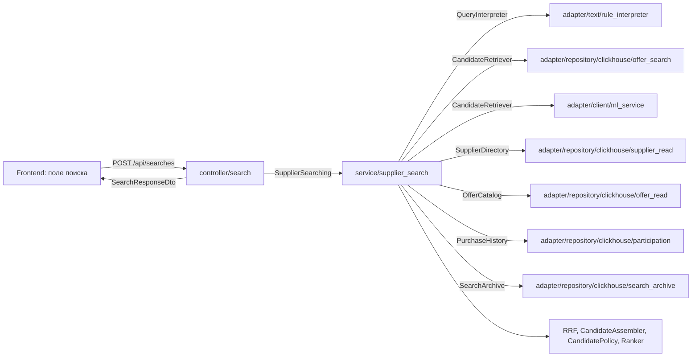

# Поиск поставщиков по тексту: API, домен, сервис, фронтенд

Ветка: `feature/supplier-search-api`. Статус: фазы 0–1 выполнены, фаза 2 — backend на chDB и живом ClickHouse проверен, фронтенд проверен против живого API; ML-канал реализован за флагом, рантайм не подключён; фаза 4 — загрузка CSV закупок работает на общем ядре подбора, проверена на chDB и вживую.

## 1. Цель

Пользователь описывает потребность свободным текстом («крупа гречневая ядрица 500 кг, рис шлифованный 200 кг, доставка в Санкт-Петербург»). LOTIVE возвращает позиции, которые удалось выделить из текста, и ранжированный список компаний — производителей, дистрибьюторов, поставщиков. Для каждой компании есть основания: какие карточки товаров совпали, из какого источника, когда проверены, опыт закупок и что нужно уточнить.

Это второй вход в тот же продукт, что и загрузка файла: текст → позиции → кандидаты → основания. Поэтому поиск по тексту и рекомендация по закупке строятся на одном доменном ядре, а фронтенд показывает результат в уже готовом рабочем пространстве закупки.

Критерии успеха:

1. `POST /api/searches` за один запрос отдаёт позиции и до 50 кандидатов с основаниями; p95 ≤ 2 с на лексическом поиске при прогретом ClickHouse.
2. Каждый кандидат объясним: статус выводится правилами из фактов, у каждого совпадения есть источник с URL и временем проверки, оценка разложена на составляющие.
3. Сервис не знает о ClickHouse, HTTP и ML-рантайме; контроллер не знает о логике поиска; любой источник кандидатов (лексика ClickHouse, ML-retrieval, их гибрид) подключается адаптером без правки сервиса.
4. Фронтенд открывает результат поиска в рабочем пространстве закупки без новых экранов разбора; моки отключаются одним флагом.
5. Нет внешних LLM/нейросетевых API; ML-рантайм — только локальный, по `ml_contr.md`.

## 2. Решения

| Вопрос | Решение | Почему |
| --- | --- | --- |
| Формат ответа | Доменная модель результата + отдельный HTTP DTO, совместимый по смыслу с `Recommendation` фронтенда | Сервис не зависит от UI; фронтенд переиспользует рабочее пространство; контракт версионируется в одном месте |
| Текст для людей в ответе | Только коды и параметры (`role`, `checkReason`, `highlights[].code`), без готовых фраз | Язык решает фронтенд; соответствует правилу «язык нигде не зашит» |
| Где логика | `service/supplier_search/` по слоям AGENTS.md, не отдельный сервис | Один процесс, один контейнер зависимостей, общие модели и репозитории |
| Как ищем кандидатов | Порт `CandidateRetriever` с адаптерами: лексический ClickHouse сейчас, ML-retrieval потом, слияние RRF в сервисе | Работает с первого дня; ML подключается без правки сервиса; слияние — бизнес-правило |
| Как выделяем позиции | Порт `QueryInterpreter`: правила разбиения сейчас, ML-извлечение потом | То же разделение «работает сейчас / улучшаем потом» |
| Статус кандидата | Доменная политика `CandidatePolicy` по правилам `ml_contr.md` §7 | Объяснимость и единые правила для текста и файла |
| Синхронность | Синхронный запрос с таймаутом; результат сохраняется и доступен по `GET /api/searches/{id}` | Ссылку можно открыть повторно, история поисков, без очередей на старте |
| Модели | `@dataclass(frozen=True, slots=True)` в домене, Pydantic только в контроллере | Как в текущем backend; валидация HTTP — на границе |
| Тесты | `pytest` + `pytest-asyncio` для нового кода, `httpx.ASGITransport` для контроллера, chDB для SQL | В `ruff.toml` уже включены правила `PT`; старые smoke-скрипты остаются |

## 3. Правила кода (обязательны для обоих агентов)

- Слои строго по AGENTS.md: `controller → service → (protocols) ← adapter`, `models` общие. Сервис импортирует только `src.models`, `src.service.*` и стандартную библиотеку.
- Никаких комментариев и докстрингов в новом коде. Смысл — в именах, типах и тестах.
- Импорты только в начале файла, только абсолютные (`from src.service.supplier_search.protocols import CandidateRetriever`). Никаких импортов внутри функций, никаких `from . import`.
- Интерфейсы — `typing.Protocol` в `protocols.py` рядом с потребителем. Ошибки — в `errors.py` уровня слоя.
- Всё асинхронное; блокирующий драйвер ClickHouse уже вынесен в потоки `ConnectGateway`.
- Одна логическая часть — одна папка. Файл ≤ 250 строк, функция ≤ 40 строк, класс с одной ответственностью.
- Объекты-значения неизменяемы и проверяют инварианты в `__post_init__`; фабрики — `classmethod`. Никаких «голых» `dict` между слоями: только модели и DTO.
- Строки для ИНН, ОКПД2, лотов и артикулов; `Decimal` для денег; `datetime` с UTC.
- `ruff check`, `ruff format`, `mypy --strict` на `src/` и тестах зелёные; покрытие нового кода ≥ 90 % строк.

## 4. Архитектура



Поток одного запроса:

1. Контроллер валидирует JSON, локаль, лимиты; строит `SearchQuery`; вызывает `SupplierSearching.search`.
2. Сервис: `QueryInterpreter` → `SearchRequest` с позициями `QueryItem`.
3. Все `CandidateRetriever` параллельно; каждый возвращает `RetrievalHits` (кандидаты с рангами канала и id совпавших карточек).
4. `ReciprocalRankFusion` сливает каналы в `FusedCandidate` по `supplier_id`.
5. Пакетное обогащение: `SupplierDirectory.get_many`, `OfferCatalog.get_many`, `PurchaseHistory.summarize`.
6. `CandidateAssembler` собирает `SupplierCandidate`: роль, совпадения по позициям с основанием и источником, история.
7. `CandidatePolicy` присваивает статус и причины проверки; `CandidateRanker` упорядочивает и считает `ScoreBreakdown`.
8. `SearchArchive.save` сохраняет результат; контроллер отображает его в DTO.

Частичные отказы: если упал один канал поиска или один источник обогащения, результат возвращается с `warnings`, затронутые кандидаты получают `check`. Если упали все каналы — ошибка `search_unavailable`.

## 5. Доменные модели (`backend/src/models/`)

Существующие `Supplier`, `Offer`, `Source`, перечисления — без изменений, кроме новых значений перечислений ниже.

```text
backend/src/models/
  enums.py              + CandidateStatus, MatchBasis, CheckReason, EvidenceKind, PurchaseOutcome, ItemOrigin, Highlight
  search.py             SearchText, CandidateLimit, Locale, SearchFilters, SearchQuery
  query_item.py         QueryItem, Quantity, SearchRequest
  candidate.py          SupplierCandidate, ProductMatch, Evidence, PurchaseRecord, PurchaseSummary, CompanyRole
  scoring.py            Score, ChannelRank, ScoreBreakdown
  search_result.py      SearchResult, PipelineInfo, SearchWarning
```

```python
class CandidateStatus(StrEnum):
    RECOMMENDED = "recommended"
    CHECK = "check"


class MatchBasis(StrEnum):
    STOCK = "stock"
    CATALOG = "catalog"
    INFERRED = "inferred"


class CheckReason(StrEnum):
    ROLE_UNCONFIRMED = "roleUnconfirmed"
    RANGE_UNCONFIRMED = "rangeUnconfirmed"
    IDENTITY_CONFLICT = "identityConflict"
    INN_MISSING = "innMissing"
    NO_CURRENT_OFFER = "noCurrentOffer"
    SOURCE_UNAVAILABLE = "sourceUnavailable"


class EvidenceKind(StrEnum):
    CATALOG = "catalog"
    PRICE = "price"
    PURCHASE = "purchase"
    REGISTRY = "registry"


class ItemOrigin(StrEnum):
    TEXT = "text"
    INFERRED = "inferred"
    USER = "user"


class CompanyRole(StrEnum):
    MANUFACTURER = "manufacturer"
    DISTRIBUTOR = "distributor"
    SUPPLIER = "supplier"
    SUPPLIER_DISTRIBUTOR = "supplierDistributor"
    SERVICE_PROVIDER = "serviceProvider"
    UNKNOWN = "unknown"
```

```python
@dataclass(frozen=True, slots=True)
class SearchText:
    value: str

    MAX_LENGTH: ClassVar[int] = 4000

    def __post_init__(self) -> None:
        normalized = " ".join(self.value.split())
        if not normalized:
            raise EmptySearchTextError
        if len(normalized) > self.MAX_LENGTH:
            raise SearchTextTooLongError(self.MAX_LENGTH)
        object.__setattr__(self, "value", normalized)


@dataclass(frozen=True, slots=True)
class SearchQuery:
    text: SearchText
    limit: CandidateLimit
    locale: Locale
    filters: SearchFilters


@dataclass(frozen=True, slots=True)
class QueryItem:
    item_id: str
    name: str
    okpd2: str
    item_type: ItemType
    quantity: Quantity | None
    origin: ItemOrigin
    confidence: float | None


@dataclass(frozen=True, slots=True)
class Evidence:
    kind: EvidenceKind
    title: str
    url: str
    checked_at: datetime


@dataclass(frozen=True, slots=True)
class ProductMatch:
    item_id: str
    basis: MatchBasis
    offer_id: UUID | None
    evidence: Evidence | None


@dataclass(frozen=True, slots=True)
class ScoreBreakdown:
    fusion: Score
    coverage: Score
    evidence: Score
    history: Score
    total: Score
    channels: tuple[ChannelRank, ...]


@dataclass(frozen=True, slots=True)
class SupplierCandidate:
    supplier: Supplier
    role: CompanyRole
    role_evidence: Evidence | None
    status: CandidateStatus
    check_reasons: tuple[CheckReason, ...]
    matches: tuple[ProductMatch, ...]
    history: PurchaseSummary
    highlights: tuple[Highlight, ...]
    score: ScoreBreakdown
    rank: int


@dataclass(frozen=True, slots=True)
class SearchResult:
    search_id: UUID
    query: SearchQuery
    items: tuple[QueryItem, ...]
    candidates: tuple[SupplierCandidate, ...]
    pipeline: PipelineInfo
    warnings: tuple[SearchWarning, ...]
    created_at: datetime
```

Ошибки домена — `backend/src/models/errors.py`: `DomainError`, `EmptySearchTextError`, `SearchTextTooLongError`, `InvalidCandidateLimitError`, `InvalidScoreError`, `UnsupportedLocaleError`.

## 6. Сервис (`backend/src/service/supplier_search/`)

```text
backend/src/service/supplier_search/
  protocols.py          порты, которые потребляет сервис
  service.py            SupplierSearchService — сценарий целиком
  interpretation/       QueryNormalizer (стоп-слова, ё→е, единицы), ItemSplitter
  fusion/               ReciprocalRankFusion
  assembly/             CandidateAssembler, RoleResolver, MatchResolver, HighlightComposer
  policy/               CandidatePolicy, PolicyRule и правила по одному на файл
  ranking/              CandidateRanker, ScoreWeights
backend/src/service/errors.py
  + SearchError, SearchUnavailableError, SearchTimeoutError, SearchNotFoundError
```

Порты:

```python
class QueryInterpreter(Protocol):
    async def interpret(self, query: SearchQuery) -> SearchRequest: ...


class CandidateRetriever(Protocol):
    @property
    def channel(self) -> str: ...

    async def retrieve(self, request: SearchRequest, limit: int) -> RetrievalHits: ...


class SupplierDirectory(Protocol):
    async def get_many(self, supplier_ids: Sequence[UUID]) -> Mapping[UUID, Supplier]: ...


class OfferCatalog(Protocol):
    async def get_many(self, offer_ids: Sequence[UUID]) -> Mapping[UUID, OfferEvidence]: ...

    async def current_for(self, supplier_ids: Sequence[UUID]) -> Mapping[UUID, tuple[OfferEvidence, ...]]: ...


class PurchaseHistory(Protocol):
    async def summarize(
        self, supplier_ids: Sequence[UUID], items: Sequence[QueryItem], as_of: datetime
    ) -> Mapping[UUID, PurchaseSummary]: ...


class SearchArchive(Protocol):
    async def save(self, result: SearchResult) -> None: ...

    async def get(self, search_id: UUID) -> SearchResult | None: ...

    async def recent(self, limit: int) -> tuple[SearchSummary, ...]: ...


class Clock(Protocol):
    def now(self) -> datetime: ...


class IdGenerator(Protocol):
    def new(self) -> UUID: ...
```

`RetrievalHits`, `FusedCandidate`, `OfferEvidence` (карточка + источник + статус связи с продавцом + совпадение с каталогом) — модели сервиса в `service/supplier_search/` или в `models/`, если их читает больше одного сервиса.

Сценарий:

```python
class SupplierSearchService:
    def __init__(
        self,
        interpreter: QueryInterpreter,
        retrievers: Sequence[CandidateRetriever],
        directory: SupplierDirectory,
        offers: OfferCatalog,
        history: PurchaseHistory,
        archive: SearchArchive,
        fusion: ReciprocalRankFusion,
        assembler: CandidateAssembler,
        policy: CandidatePolicy,
        ranker: CandidateRanker,
        clock: Clock,
        ids: IdGenerator,
        settings: SearchSettings,
    ) -> None: ...

    async def search(self, query: SearchQuery) -> SearchResult: ...

    async def get(self, search_id: UUID) -> SearchResult: ...

    async def recent(self, limit: int) -> tuple[SearchSummary, ...]: ...
```

Правила политики (каждое — класс с `def apply(self, draft: CandidateDraft) -> RuleOutcome`):

| Правило | Условие | Итог |
| --- | --- | --- |
| `InnRequiredRule` | нет валидного ИНН | `check`, `innMissing` |
| `IdentityConflictRule` | `identity_status=conflict` или `seller_status=conflict` у использованной карточки | `check`, `identityConflict` |
| `RoleConfirmedRule` | роль `unknown` или без источника | `check`, `roleUnconfirmed` |
| `CurrentOfferRule` | нет ни одной актуальной карточки | `check`, `noCurrentOffer` |
| `CoverageRule` | основания только `inferred` или покрытие позиций < порога | `check`, `rangeUnconfirmed` |
| `SourceAvailabilityRule` | обогащение кандидата упало | `check`, `sourceUnavailable` |

`recommended` — только если ни одно правило не сработало. Основание совпадения: `stock` — актуальная карточка с подтверждённым продавцом и доступностью; `catalog` — принятое `offer_matches`; иначе `inferred`. Роль: агрегат ролей актуальных карточек с источником (`manufacturer` побеждает, `distributor` + `reseller` → `supplierDistributor`).

Ранжирование: `total = w_fusion·fusion + w_coverage·coverage + w_evidence·evidence + w_history·history`, веса в `ScoreWeights` из конфигурации; `recommended` всегда выше `check` при равном покрытии; стабильная сортировка по `total`, затем по ИНН. Оценка не называется вероятностью.

## 7. Адаптеры (`backend/src/adapter/`)

```text
backend/src/adapter/repository/clickhouse/
  offer_search/         ClickHouseLexicalRetriever: токены → SQL по offers_current, BM25 по найденным
  supplier_read/        ClickHouseSupplierDirectory
  offer_read/           ClickHouseOfferCatalog: карточки, источники, offer_matches
  participation/        ClickHousePurchaseHistory: lot_participations + procurement_lots/items
  search_archive/       ClickHouseSearchArchive: таблицы searches
backend/src/adapter/text/
  rule_interpreter/     RuleQueryInterpreter: разбиение на позиции, количество, единицы, ОКПД2 из текста
  analyzer/             RussianAnalyzer: нормализация и стемминг (snowballstemmer)
backend/src/adapter/client/ml_service/
  client.py             MlServiceRetriever по ml_contr.md §5, httpx.AsyncClient, таймауты, requestId
  dto.py                wire DTO запроса и ответа ML
backend/src/adapter/system/
  clock.py, ids.py      SystemClock (перенос из adapter/clock.py), Uuid4Generator
```

Миграции (новые файлы, старые не трогать):

- `0004_offer_search_index.sql`: материализованная колонка `search_text` (lower(name, brand, article, source_category, description-префикс)), индекс `tokenbf_v1` на `search_text`, `ngrambf_v1` для частичных совпадений, проекция по `supplier_id`.
- `0005_searches.sql`: `searches` (`search_id`, `text`, `locale`, `items` JSON, `pipeline`, `warnings`, `created_at`, `version`, `is_deleted`) и `search_candidates` (`search_id`, `rank`, `supplier_id`, `status`, `payload` JSON) на `ReplacingMergeTree`, представления `*_current`.

Лексический поиск: SQL отбирает до 500 карточек по `hasToken`/`multiSearchAny` с префильтром индексом; BM25 и агрегация карточек в компании — в адаптере, канал возвращает ранги компаний и id совпавших карточек по позициям. Запросы только параметризованные.

## 8. Контроллер и приложение (`backend/src/controller/`, `backend/src/application/`)

```text
backend/src/controller/http/
  app.py                create_app(container) → FastAPI, lifespan, роутеры, middleware
  middleware.py         RequestIdMiddleware, ServerTimingMiddleware, LocaleMiddleware
  errors.py             ApiErrorDto, обработчики ServiceError/DomainError/RequestValidationError
  protocols.py          ContainerFactory
backend/src/controller/search/
  router.py             POST /api/searches, GET /api/searches/{id}, GET /api/searches
  dto.py                SearchRequestDto, SearchResponseDto, CandidateDto, MatchDto, EvidenceDto, ...
  mapper.py             SearchResult → SearchResponseDto, SearchRequestDto → SearchQuery
  protocols.py          SupplierSearching
backend/src/controller/supplier/
  router.py             GET /api/suppliers/{supplier_id}, GET /api/suppliers/{supplier_id}/offers
  dto.py, mapper.py, protocols.py
backend/src/controller/health/
  router.py             GET /api/health/live, GET /api/health/ready
backend/src/controller/api/
  main.py               uvicorn-вход: create_app(Container(AppConfig.from_env()))
backend/src/application/
  config.py             + ApiConfig, SearchConfig, MlServiceConfig
  container.py          + supplier_search(), supplier_profile(), health()
```

HTTP-контракт:

```http
POST /api/searches
Content-Type: application/json
Accept-Language: ru

{"text": "крупа гречневая ядрица 500 кг; рис шлифованный", "limit": 20, "filters": {"region": "78"}}
```

```json
{
  "searchId": "1f0c...",
  "requestId": "b686...",
  "query": {"text": "крупа гречневая ядрица 500 кг; рис шлифованный", "locale": "ru"},
  "items": [
    {"id": "i1", "name": "Крупа гречневая ядрица", "okpd2": "10.61.32.113", "origin": "text", "quantity": {"value": "500", "unit": "кг"}}
  ],
  "candidates": [
    {
      "rank": 1,
      "id": "6c1e...",
      "name": "ООО «Северный Провиант»",
      "inn": "7800000011",
      "role": "supplierDistributor",
      "roleSource": {"kind": "catalog", "title": "Каталог: крупы", "url": "https://...", "checkedAt": "2026-09-28T10:00:00Z"},
      "status": "recommended",
      "checkReasons": [],
      "matches": [{"itemId": "i1", "basis": "stock", "offerId": "9a...", "source": {"kind": "price", "title": "Прайс-лист", "url": "https://...", "checkedAt": "2026-09-29T08:00:00Z"}}],
      "history": {"similarPurchases": 11, "wins": 4, "recent": []},
      "highlights": [{"code": "coversItems", "params": {"matched": 2, "total": 2}}],
      "score": {"total": 0.82, "fusion": 0.9, "coverage": 1.0, "evidence": 0.8, "history": 0.4},
      "contacts": {"site": "https://...", "email": "", "phone": ""}
    }
  ],
  "pipeline": {"channels": ["lexical"], "version": "search-v1", "asOf": "2026-10-01T12:00:00Z"},
  "warnings": []
}
```

Ошибки — `{"code", "message", "requestId"}`:

| HTTP | code | Когда |
| --- | --- | --- |
| 422 | `empty_query` | пустой текст |
| 422 | `query_too_long` | больше `SearchText.MAX_LENGTH` |
| 422 | `invalid_limit` | вне 1..50 |
| 422 | `invalid_request` | ошибка схемы запроса |
| 404 | `search_not_found` | нет поиска с таким id |
| 404 | `supplier_not_found` | нет поставщика |
| 503 | `search_unavailable` | все каналы поиска недоступны |
| 504 | `search_timeout` | превышен таймаут сценария |
| 500 | `internal_error` | прочее, без деталей наружу |

Сквозное: `X-Request-Id` (входящий или новый), `Server-Timing` по стадиям, структурные логи без текста запроса целиком (хэш + длина), CORS выключен — фронтенд ходит через nginx-прокси `/api`.

Зависимости `backend/pyproject.toml`: `fastapi`, `uvicorn[standard]`, `pydantic>=2`, `snowballstemmer`; dev: `pytest`, `pytest-asyncio`, `mypy`, `httpx` (уже есть). Скрипт `api = "src.controller.api.main:run"`.

Инфраструктура: сервис `api` в `docker-compose.yml` (порт 8000, зависит от `clickhouse` и `migrate`, healthcheck на `/api/health/ready`), `deploy/nginx.conf` — прокси `/api/` на `api:8000` через `resolver` и переменную (чтобы nginx стартовал без backend), переменные в `backend/README.md` и корневом `README.md`.

## 9. Фронтенд

```text
frontend/src/entities/search/
  model.ts              SearchResult, Candidate, Match, Evidence, Highlight — по DTO
  parse.ts              строгий разбор ответа
  gateway.ts            SearchGateway { demo, search, get, recent }
  http.ts               POST/GET /api/searches
  demo/                 демо-шлюз и данные на ru/en
  queries.ts            TanStack Query: ключи с локалью
frontend/src/features/search-box/
                        поле «Опишите, что нужно» с подсказками, Enter/⌘Enter, история
frontend/src/pages/search/
                        /search?q=…: результат в рабочем пространстве закупки
```

- Точка входа: поле поиска на странице «Загрузки» над зоной CSV и отдельная вкладка «Поиск» в шапке (третья вкладка, индикатор переезжает).
- Результат открывается в рабочем пространстве `pages/lot`: колонка «Позиции» из `items`, «Кандидаты», «Основания». Общие части (`company-list`, `evidence-panel`, `segment-meter`) выносятся из `pages/lot` в `widgets`-уровень `features/candidate-workspace`, чтобы обе страницы использовали один код.
- `highlights` и `checkReasons` переводятся словарями `search.json`; новые коды без перевода — тест падает.
- `VITE_DEMO_MODE` переключает демо-шлюз поиска так же, как загрузки.

## 10. Работа двух агентов

### Агент A — платформа и контракт

Владеет: `controller/**`, `application/**`, `pyproject.toml`, `Dockerfile`, `docker-compose.yml`, `deploy/nginx.conf`, контракт `contracts/search/*.json`, фронтенд `entities/search`, `features/search-box`, `pages/search`, `features/candidate-workspace`.

### Агент B — поиск (Андрей)

Владеет: `models/**` (новые файлы), `service/supplier_search/**`, `service/errors.py`, `adapter/repository/clickhouse/{offer_search,supplier_read,offer_read,participation,search_archive}`, `adapter/text/**`, `adapter/client/ml_service/**`, миграции `0004`, `0005`.

Общие файлы меняются только точечно и только владельцем: `models/enums.py` — B, `application/container.py` — A (B присылает фабрику в описании PR или добавляет одну функцию в конец по договорённости).

### Фазы

**Фаза 0 — контракт (вместе, первым коммитом, ~полдня).**

- [x] B: доменные модели раздела 5 с инвариантами и тестами объектов-значений.
- [x] B: `service/supplier_search/protocols.py` и сигнатуры `SupplierSearchService` с `raise NotImplementedError` в теле.
- [x] A: `contracts/search/request.example.json`, `response.example.json`, `error.example.json`; DTO раздела 8.
- [x] Оба: ревью и фиксация. Дальше модели и порты меняются только через согласование.

**Фаза 1 — параллельно.**

Агент A:

- [x] FastAPI-приложение: `create_app`, lifespan с одним `Container`, middleware, обработчики ошибок, health.
- [x] `controller/search`: роуты, DTO, маппер, `protocols.SupplierSearching`.
- [x] Фейковый `SupplierSearching` в тестах; контрактные тесты: ответ совпадает со схемой `contracts/search/*.json`, все коды ошибок, `X-Request-Id`, `Accept-Language`.
- [x] `controller/supplier`: профиль и карточки поставщика.
- [x] `pyproject.toml`, `Dockerfile` (две цели: `job` и `api`), сервис `api` в compose, nginx-прокси, README.
- [x] Фронтенд: `entities/search` с демо-шлюзом и парсером, тест «демо-ответ проходит parse», `features/search-box`, маршрут `/search`, вынос `candidate-workspace`.

Агент B:

- [x] `adapter/text`: анализатор и `RuleQueryInterpreter` (разделители `;`, перевод строк, «и», количества и единицы, коды ОКПД2 в тексте).
- [x] Миграция `0004` и `ClickHouseLexicalRetriever`; тесты на chDB с фикстурными карточками.
- [x] Адаптеры чтения: поставщики, карточки с источниками и `offer_matches`, история закупок; тесты на chDB.
- [x] Сервис: `ReciprocalRankFusion`, `CandidateAssembler`, `RoleResolver`, `MatchResolver`, правила `CandidatePolicy`, `CandidateRanker`, `HighlightComposer`; юнит-тесты на каждое правило с фейками портов.
- [x] `SupplierSearchService.search` целиком: параллельные каналы, таймауты, частичные отказы → `warnings`.
- [x] Миграция `0005` и `ClickHouseSearchArchive`; `get`, `recent`.
- [x] Фабрика `supplier_search()` в контейнере.

**Фаза 2 — интеграция (вместе).**

- [x] A подключает настоящий сервис из контейнера вместо фейка; e2e на chDB: текст → кандидаты → `GET /api/searches/{id}`.
- [x] Фронтенд: `VITE_DEMO_MODE=false` против поднятого compose — проверено вручную скриптом Playwright (поиск → кандидаты → основания → перезагрузка по ссылке, 390 px). Автоматический e2e против compose — в CI.
- [ ] Нагрузочный замер: 50 последовательных запросов, p50/p95, запись в `ml/EXPERIMENTS.md` как технический замер, не метрика качества.

**Фаза 3 — ML-канал (B, после фазы 2).**

- [x] `MlServiceRetriever` по `ml_contr.md` §5: `schemaVersion`, эхо `requestId`, таймауты, ретрай только транзиентных ошибок.
- [x] Включение канала флагом `SEARCH_ML_ENABLED`; RRF трёх каналов (lexical, history, semantic). Сравнение на отложенной выборке запросов — после запуска ML-рантайма.
- [ ] Порт `QueryInterpreter` на ML-извлечение позиций, если экстрактор валидирован; иначе предупреждение в `warnings`.

**Фаза 4 — общий конвейер (обоим, отдельной задачей).**

- [x] Ядро подбора выделено в `SupplierMatcher.match(SearchRequest) -> MatchOutcome` (каналы, RRF, обогащение, политика, ранжирование); `SupplierSearchService` — тонкая обёртка: интерпретация текста, таймаут, архив. Тесты поиска не менялись, кроме сборки сервиса.
- [x] Модели: `ProcurementLot`, `RowIssue`, `NoticeFile` (`models/procurement.py`), `LotResult` со статусом (`models/lot_result.py`), `Upload`, `LotProgress`, `StatusCounts`, `UploadSummary`, `UploadDetail`, `LotDetail`, `ProcessedLot`, `UploadResults` (`models/upload.py`); перечисления `IssueCode`, `LotStatus`; ошибки файла в `models/errors.py`.
- [x] Адаптер `adapter/file/notice_csv/`: формат `entities/notice` (UTF-8/BOM/Windows-1251, `;`/`,`/табуляция, кавычки и переносы, те же коды проблем строк), разбор в пуле потоков, отказ двоичных файлов.
- [x] Сервис `service/procurement_upload/`: `ProcurementUploadService` (файл → закупки → сохранение → очередь), `LotProcessor` (текст предмета → `QueryInterpreter` → `SupplierMatcher` → `LotResult`, таймаут на закупку), `LotRunner` (in-process `asyncio`, `UPLOAD_CONCURRENCY` воркеров, `UPLOAD_ATTEMPTS` попыток с паузой, затем `failed`; при старте дообрабатывает закупки без результата).
- [x] Хранение: миграция `0006_uploads.sql` (`uploads`, `upload_lots`, `upload_results` на `ReplacingMergeTree`, представления `*_current`), адаптер `clickhouse/upload_store/` (результат — JSON на кодеке архива поиска, выборки по 500 номеров).
- [x] Контроллер `controller/upload/`: `GET/POST /api/uploads`, `GET /api/uploads/{id}`, `GET /api/uploads/{id}/lots/{lotId}`, `POST /api/uploads/{id}/results`; коды `missing_file`, `file_too_large`, `unsupported_file_type`, `invalid_file`, `missing_columns`, `too_many_rows`, `no_valid_lots`, `upload_not_found`, `lot_not_found`; раннер стартует и останавливается в lifespan; nginx `client_max_body_size 12m` для `/api/uploads`.
- [x] Контракт рекомендации переведён на коды, как у поиска (вариант «б»): `checkReasons`, `highlights`, без `summary`/`clarify`/`checkReason`; «что уточнить» и сводку строит фронтенд из кодов. Статус закупки `failed` добавлен во фронтенд. Примеры — `contracts/upload/*.example.json`, их проверяют Pydantic-DTO и `entities/upload/parse.ts`.
- [x] Тесты: модели, сервис с фейками портов (частичные отказы, повторы, дообработка после перезапуска), CSV на искусственных файлах, store на chDB, контроллер через `ASGITransport`, сквозной chDB-тест CSV → закупки → результаты → `GET`. Live-проверка — ниже.
- [ ] Год и ссылка на протокол для прошлых закупок (`purchases[].year`, `source`) — нужны дата и URL в `lot_participations`; сейчас `null`.
- [ ] ML-извлечение позиций из текста закупки — после валидации экстрактора (общая задача с фазой 3).

Проверка фазы 4 (2026-10-01):

- Backend на Windows: `ruff check`, `ruff format --check`, `mypy --strict`, `pytest` — зелёные; в Linux с chDB полный прогон — 367 тестов, покрытие 99,6 %.
- Живой стек (`docker compose up -d clickhouse migrate api`, искусственные данные в ClickHouse): CSV в Windows-1251 из 4 строк → 3 закупки и 1 отклонённая строка (`badLotId`); статусы `ready`, `ready`, `noCandidates`; у закупки с гречкой и рисом лидер `recommended` с основаниями `stock`, второй кандидат `check` (`innMissing`, `roleUnconfirmed`, `noCurrentOffer`, `rangeUnconfirmed`). Ошибки `missing_file`, `unsupported_file_type`, `missing_columns` — по контракту. Перезапуск контейнера API посреди обработки 60 закупок: после старта лог `resuming unfinished lots`, все 60 обработаны.
- Фронтенд с `VITE_DEMO_MODE=false` против живого API (Playwright-скрипт, 1440 px): выбор CSV → диалог проверки → «Обработать 3 закупки» → прогресс до «обработка завершена» → таблица закупок со статусами и ценами → разбор закупки: две позиции «из извещения», лидер «Рекомендован» с подтверждённым наличием и ссылками на прайс, второй кандидат «Нет ИНН» → выгрузка двух CSV через `POST …/results` → перезагрузка страницы закупки по ссылке.

## 11. Тесты и приёмка

| Уровень | Что | Где |
| --- | --- | --- |
| Модели | инварианты объектов-значений, сериализация перечислений | `backend/tests/models/` |
| Сервис | каждое правило политики, RRF, сборка кандидата, роли, частичные отказы, таймаут | `backend/tests/service/supplier_search/` |
| Адаптеры | SQL на chDB с фикстурами, BM25, параметризация, пустые и конфликтные данные | `backend/tests/adapter/` |
| Контроллер | статусы, схемы ответа, коды ошибок, заголовки, локаль | `backend/tests/controller/` |
| Контракт | `contracts/search/*.json` проходят и Pydantic-DTO, и `frontend/src/entities/search/parse.ts` | оба стека |
| E2E | compose: текст → результат → открытие → основания | `frontend/e2e/search.spec.ts` |

Готово, когда:

- [x] `ruff check`, `ruff format --check`, `mypy --strict`, `pytest` с покрытием ≥ 90 % нового кода — зелёные.
- [x] Фронтенд `npm run verify` и `npx playwright test` — зелёные.
- [x] Во всём новом коде нет комментариев, докстрингов и импортов внутри функций (проверка `ruff` + ревью).
- [x] `recommended` никогда не выдаётся без валидного ИНН, подтверждённой роли и актуальной карточки — отдельный тест на каждое условие.
- [x] Каждая ссылка в ответе — абсолютный http(s) URL реально полученного источника.
- [x] README описывает запуск `api`, переменные и примеры `curl`.

## 12. Риски

| Риск | Что делаем |
| --- | --- |
| В `offers` мало данных, пока адаптеры каталогов выключены | Канал лексики дополнительно ищет по `procurement_items` и истории участия → основания `inferred`, статус `check` |
| `ConnectGateway` сериализует запросы одним `asyncio.Lock` | Пул клиентов в адаптере (B), замер в фазе 2 |
| Расхождение контракта бэкенда и фронтенда | Общие примеры `contracts/search/*.json` проверяются тестами обеих сторон |
| ML-рантайм недоступен на демо | Лексический канал работает самостоятельно; ML-канал за флагом |
| Конфликт правок в общих файлах | Владельцы файлов из раздела 10, мелкие коммиты, ребейз на свою ветку перед PR |

## 13. Отступления от плана при реализации

- Сборка API вынесена из старого `Container` в `application/api.py` (`ApiContainer`): он получает подключение к ClickHouse лениво через `DeferredGateway`, поэтому API стартует и отвечает `ready=false`, пока хранилище недоступно.
- Добавлен второй лексический канал `history` (`clickhouse/history_search`): поиск по позициям и предметам архивных лотов с агрегацией участников. Он даёт основания `inferred` и статус `check`.
- `search_text` в `offers` — колонка `DEFAULT` с принудительной материализацией, а не `MATERIALIZED`: иначе её не видит `SELECT *` в `offers_current`, а `withdraw_absent` ломается на `INSERT … SELECT *`. Проекция по `supplier_id` заменена индексом `bloom_filter`.
- Сервис проверки готовности (`service/health`) опрашивает зависимости через порт `DependencyProbe`; сейчас подключён только ClickHouse.
- Правила кода проверяются тестами `backend/tests/architecture`: комментарии, докстринги, локальные и относительные импорты, длина файлов и функций, направления импортов между слоями.
- Прогон SQL-тестов на chDB — только в Linux: `docker compose --profile tests run --rm backend-tests`.
- Фаза 4: отдельный `RecommendationService` из `ml_contr.md` не появился. Загрузка — это `ProcurementUploadService`, а рекомендация закупки — `LotResult` на общем `SupplierMatcher`. Одна загрузка содержит много закупок (`/api/uploads`), поэтому `multiple_lots_not_supported` не нужен, а `invalid_workbook` заменён на `invalid_file` (CSV вместо XLSX).
- Ответ рекомендации не содержит прозы: `summary`, `clarify` и `checkReason` из `ml_contr.md` §3 заменены кодами `checkReasons` и `highlights`. Пустой список компаний — успешный ответ со статусом закупки `noCandidates`, а не 422 `no_candidates_found`.
- Обработка закупок идёт в процессе API без очередей. Закупку, которая так и не обработалась, повторно запускает только старт API; статус `failed` окончательный.
